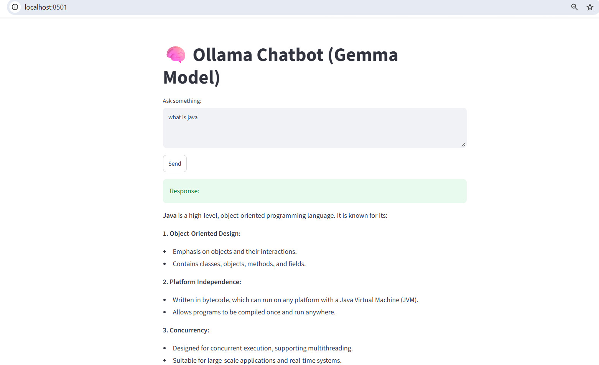

# 🧠 Ollama Gemma Chatbot

A simple chatbot built with **Python + Streamlit + Ollama** using the **Gemma local LLM model**.  
This project demonstrates how to integrate and run a local Large Language Model (LLM) directly on your machine.

---

## 📸 Demo Screenshot


---
## ⚙️ Installation & Setup

### 1. Install Ollama
Download and install Ollama from [https://ollama.ai](https://ollama.ai).

### 2. Pull the Gemma model
```bash
ollama pull gemma

### 3. Clone this repository
```bash
git clone https://github.com/sagardeshmukh17/ollama-gemma-chatbot.git
cd ollama-gemma-chatbot

### 4. Create virtual environment (optional but recommended)
```bash
python -m venv .venv
.venv\Scripts\activate   # Windows

### 5. Install dependencies
```bash
pip install -r requirements.txt

### 6. Run the Streamlit app
```bash
streamlit run frontend.py

📂 Project Structure
Code
├── backend.py        # Handles Ollama API calls
├── frontend.py       # Streamlit UI
├── requirements.txt  # Dependencies
├── .gitignore        # Ignore sensitive/unnecessary files
├── Screenshot.png    # Demo screenshot
└── README.md         # Project documentation

